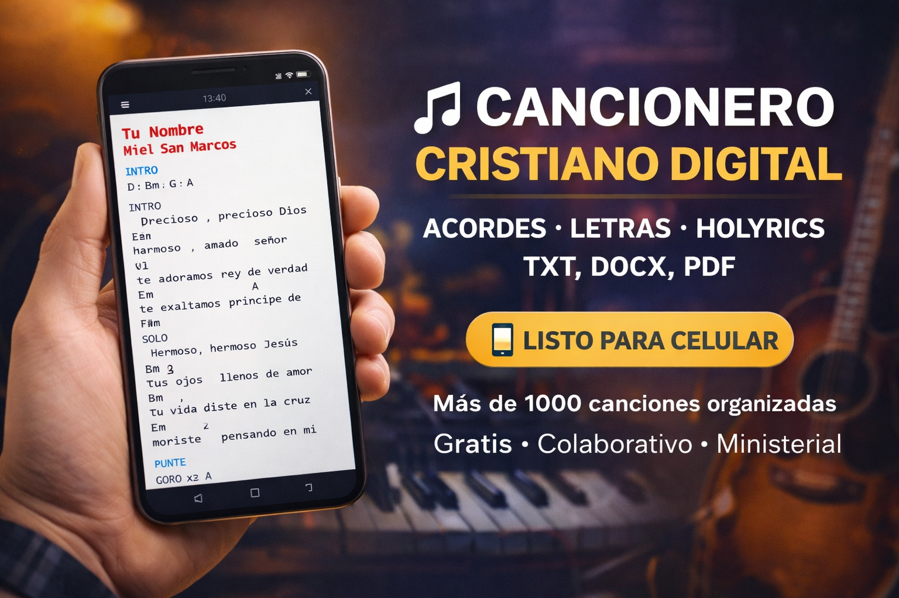
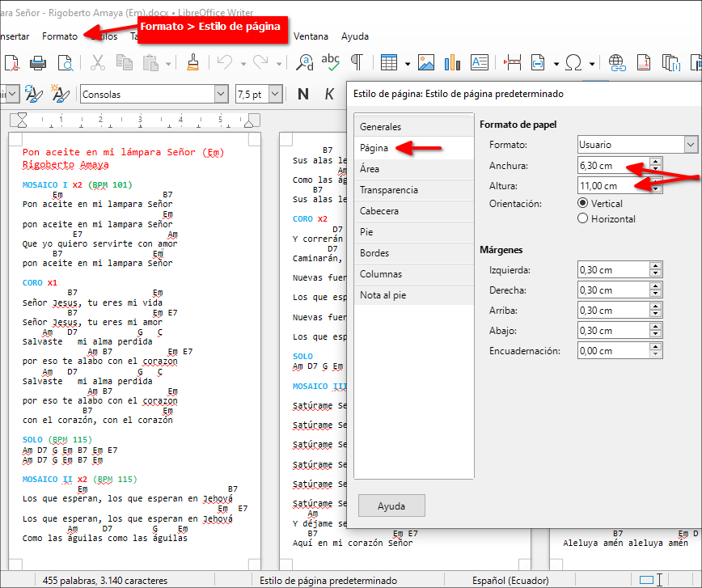
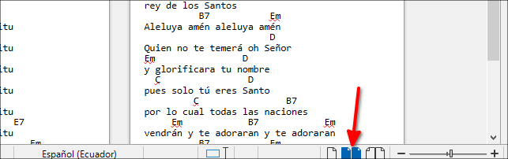
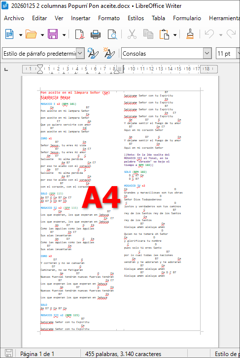

# 🎶 Cancionero Cristiano Colaborativo

Repositorio de apoyo para **músicos de iglesia**, **líderes de alabanza**, **guitarristas**, **pianistas** y **proyección de letras**.



Aquí encontrarás canciones cristianas organizadas con:

✅ Acordes de guitarra  
✅ Versiones para impresión  
✅ Formatos listos para celular  
✅ Letras para proyección (Holyrics)  
✅ Tablaturas  
✅ Acordes de piano  
✅ Diccionarios de acordes  
✅ Archivos ChordPro  
✅ PDFs listos para usar en culto  

Este repositorio está pensado para servir al ministerio de alabanza.  

---

## 📂 ¿Qué contiene?

### 🎸 Acordes de Guitarra
Canciones organizadas por artista con acordes que me dió mi primo Efraín Chilán (para revisar).

📁 Carpeta principal:

```
Acordes cristianos txt
```

---

### 🎸📱 Acordes de Guitarra para Celular (formato pequeño)
Diseñados para verse perfectamente en pantallas de teléfono:

📁 Carpeta:

```
Acordes(63x110mm)
```

ejemplo del formato de los acordes que contienen los archivos allí dentro:

```
La niña de tus ojos
Daniel Calveti

INTRO
C G Am F
C G Am F

VERSO I X2
         C                  G
Me viste a mi cuando nadie me vio
          Am                 F
Me amaste a mi cuando nadie me amo

VERSO II X2
            C                G
Y me diste nombre yo soy tu niña
               Am                     F
La niña de tus ojos por que me amaste a mí

PRE-CORO X2
          C               G
Me amaste a mí, Me amaste a mí,
          Am              F
Me amaste a mí, Me amaste a mí

CORO X 4
C                        G                       
Te amo más que a mi vida, 
                         Am
te amo más que a mi vida,
                           F
Te amo más que a mi vida, más
```

---

#### 📱 ¿Por qué estos documentos NO están en tamaño A4?

Los achivos dentro de la carpeta "Acordes(63x110mm)" no están en el tamaño A4. La mayoría de personas usan documentos tamaño **A4** porque es el estándar de impresión. Pero A4 fue pensado para **hojas de papel**, no para **pantallas de celular**.

Yo adapté estas canciones a un tamaño especial:

- 📐 Tamaño usado: **63 x 110 mm** (o lo que es lo mismo 6,3 x 11 cm), como se ve en la siguiente imagen en LibreOffice en una PC

-> Formato > Estilo de página > Página > Formato de papel > Anchura y Altura

 

En esta imagen de arriba se ven tres páginas 63 x 110 mm, esto es debido a que esa alabanza es un Mosaico de alabanzas y es muy largo. En LibreOffice para que se vean así hay que dar clic en el botón:

-> Vista de paginas multiples


Ese tamaño es parecido a una **tarjeta vertical**, y tiene una ventaja enorme:

> **Las páginas así coinciden mucho mejor con la forma de la pantalla de un teléfono**

---

#### ¿Qué problema tiene usar A4 en el celular?

Cuando abres un PDF A4 en el teléfono:

❌ La letra se ve pequeña
❌ Hay que hacer zoom constantemente
❌ Se pierde tiempo buscando la parte de la canción
❌ Es incómodo tocar y pasar páginas

Porque el A4 es ancho y grande, pero el celular es angosto y alto.

---

#### ✅ ¿Qué cambia con 63x110mm?

Estos documentos fueron diseñados pensando en el **uso durante la alabanza**, no en la impresión.

Con este tamaño:

✔ La página ocupa casi toda la pantalla
✔ Los acordes se leen sin zoom
✔ Se pasa página rápido
✔ No se pierde tiempo ampliando
✔ Funciona como “tarjeta de acordes digital”

Es como tener un **acorde impreso pequeño**, pero en versión digital.

---

#### 🎸 ¿Para quién sirve esto?

* Guitarristas
* Bajistas
* Pianistas
* Líderes de alabanza
* Músicos que usan el celular en el atril
* Personas que quieren cuidar el medio ambiente y no les gusta imprimir hojas para cuidar los arboles

---

#### 🧠 Algo que casi nadie sabe

Los documentos **NO están obligados a ser A4**.
Se pueden crear en cualquier tamaño:

* Tarjetas
* Media hoja
* Formato celular
* Formato libro pequeño

Aquí se usó un tamaño pensado **para tocar música**, no para oficina.

---

#### 🖨 ¿Se pueden imprimir?

Sí, pero su objetivo principal es:

📱 **uso digital en teléfonos**

Si los deseas imprimir así como están diseñados a 63x110mm lo mejor es que copies los arcordes de uno de esos archivos DOCX a un documento A4 que tenga dos columnas, como los ejemplos de la carpeta:

```
Imprimir A4 2 columnas
```

y de allí los imprimas como pagina A4:



**Nota**: Si deseas lo puedes guardar como PDF, así hago yo cuando los manos a imprimir al Cyber

---

#### Resumen 

Comparación si se ve un documento A4 PDF en un celular a uno 63x110mm 

|       Tamaño A4       |     Tamaño 63x110mm      |
| --------------------- | ------------------------ |
| Pensado para imprimir | Pensado para celular     |
| Mucho zoom            | Lectura directa          |
| Incomodo en celular   | Rápido y práctico        |
| Incómodo en culto     | Rápido y práctico        |
| Documento de oficina  | Herramienta para músicos |

---

### 🔤 Fuente tipográfica usada: Consolas

Los documentos en formato **63 x 110 mm** fueron diseñados usando la fuente **monoespaciada** de Microsoft **Consolas** que viene preinstalada en los productos Microsoft Office, pero se pueden usar otras fuentes monoespaciadas, como ejemplos:

- Iosevka
- 


#### ¿Por qué fuentes monoespaciada?

En las fuentes **monoespaciadas** cada letra ocupa el mismo ancho.  
Esto es importante porque:

✔ Los acordes quedan bien alineados sobre las letras  
✔ No se desordenan los espacios  
✔ Mantiene la estructura de la canción  
✔ Evita que los acordes “se corran” al abrir en otros dispositivos  

---

### 💻 Compatibilidad

La fuente Consolas fue elegida porque está disponible en casi todos los entornos donde se usan estos archivos:

|               Plataforma                |          Compatibilidad         |
| --------------------------------------- | ------------------------------- |
| Windows + Microsoft Office              | ✅ Instalada por defecto        |
| Microsoft Office 365 (nube)             | ✅ Disponible                   |
| App **Microsoft 365 Copilot** (celular) | ✅ Disponible                   |
| Linux                                   | ✅ Se puede instalar fácilmente |
| LibreOffice                             | ✅ Funciona correctamente       |

Esto permite que:

- Los documentos se vean igual en diferentes computadoras  
- Se puedan editar desde la nube  
- Se puedan modificar desde el celular  
- No se dañe el formato al compartirlos  

---

### 📱 Ventaja para músicos

Gracias a usar una fuente estándar:

- Puedes abrir el archivo en tu teléfono  
- Editar acordes desde Microsoft 365  
- Compartir con otros músicos  
- Mantener la alineación correcta  

Sin depender de fuentes raras o que otros no tengan.

---

### Resultado

Los acordes conservan su posición original sin importar:

- Sistema operativo  
- Dispositivo  
- Editor de documentos  
- Uso local o en la nube  

Esto hace que el cancionero sea **portable, estable y confiable**.


---

### 🎹 Acordes de Piano
Algunos recursor útiles para tecladistas en la carpeta:

```
Piano
```


---

### 🎼 Tablaturas de Bajo
Algunos recursos en la carpeta:

```
Bajo
```


---

### 🕮 Diccionario de Acordes

Tengo una carpeta con diccionario de acordes

```
Diccionario de Acordes
```

---

### 🎤 Letras para Proyección (Holyrics)
Canciones adaptadas para proyectar en iglesiaj, en la carpeta:

```
Letras-Holyrics
```

Formato ejemplo:

```
Tu nombre 
Miel San Marcos

//VERSO (Parte 1)
Precioso, precioso Dios
amado, amado Señor
te adoramos Rey de verdad
te exaltamos Principe de paz

//VERSO (Parte 2)
Hermoso, hermoso Jesús
tus ojos llenos de amor
tu vida diste en la cruz
moriste pensando en mi
//Aquí hay un sólo de música

//VERSO (Parte 1)
Precioso, precioso Dios
amado, amado Señor
te adoramos Rey de verdad
te exaltamos Principe de paz

//VERSO (Parte 2)
Hermoso, hermoso  Jesús
tus ojos   llenos de amor
tu vida diste en la cruz
moriste  pensando en mi

//CORO (Repetir 2 veces)
Tu nombre exaltamos
tu nombre levantamos
el nombre de Cristo
el nombre de Cristo
//(Después de repetir hay un solo)

//CORO (Repetir 3 veces)
Tu nombre exaltamos
tu nombre levantamos
el nombre de Cristo
el nombre de Cristo
```

---

### 🎼 Formato ChordPro
Algunos pocos archivos `.cho` para quienes usan software musical.

---

## 🖥 Requisitos

### Para abrir archivos DOCX
- LibreOffice  
- Microsoft Office  
- WPS Office  

Para abrir archivos PDF recomiendo:

- Foxit Reader

Para Linux: Okular, o alguno de los visores PDF


### Para celular

Para abrir archivos DOCX

- AndrOffice  
- Microsoft 365  
- WPS Office  

Para abrir archivos PDF recomiendo:

- Foxit Reader

### Para archivos TXT
Cualquier editor de texto.

---

## 🔤 Fuentes usadas
Principalmente **Consolas** para máxima compatibilidad.  
Algunos archivos antiguos usan **Iosevka** (ver carpeta `Fonts`).


---

## 🤝 ¿Quieres colaborar?

Puedes:

- Corregir acordes
- Añadir canciones
- Subir versiones mejoradas
- Agregar arreglos

Este repositorio crece gracias al servicio de músicos que desean bendecir a otros.

---

## 🙌 Propósito

Este proyecto existe para apoyar la adoración congregacional.  
Si te bendice, compártelo.

**Dios les bendiga.**
